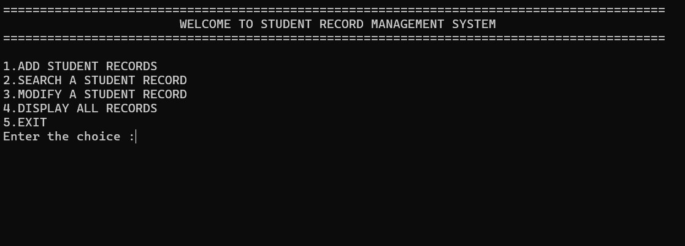
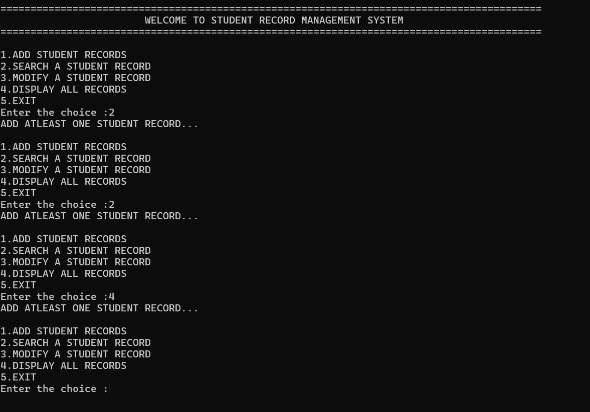
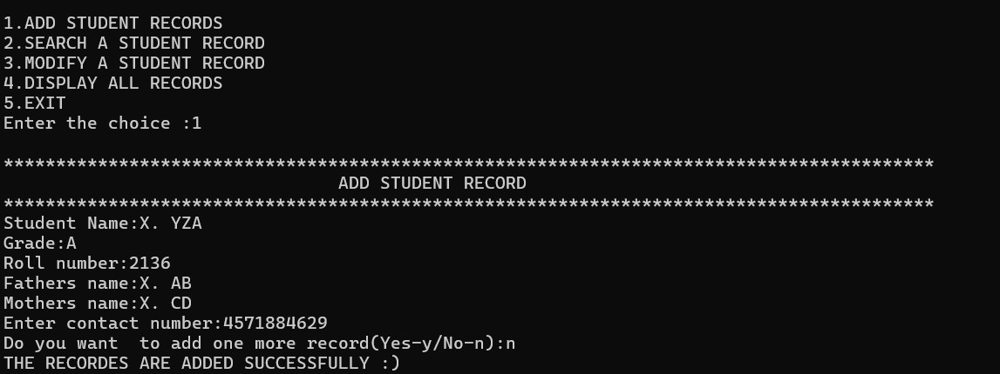
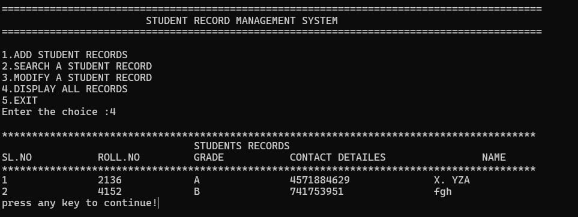

1. Project Title and Overview
Title: Choose a catchy and descriptive title that reflects the essence of your project.
Overview: Provide a concise summary of what your project does and its main objectives. Use bullet points or a brief paragraph to highlight key features and benefits.

## Features

- ✨ Add, search, modify, and display student records
- 📊 Interactive menu for user-friendly navigation
- 🛠️ Easy installation and setup with clear instructions
- 🌐 Cross-platform compatibility (Windows, Linux, macOS)

## Installation

1. Clone the repository:
   ```bash
   git clone https://github.com/kothapallysidhartha/Student-Record-Management-System.git
   cd Student-Record-Management-System
2. Compile the program:  
   ```bash
   gcc main.c functions.c -o student_records
3. Run the program:
      ```bash
      ./student_records
Running the Program
Once you have compiled and executed the program, follow these steps to manage student records:

Upon starting the program, you will see an interactive menu with options such as adding, searching, modifying, and displaying student records.

Choose an option by entering the corresponding number and follow the prompts provided by the program.

Example Demo
Here's a quick demo showing how to add and search for a student record:

In this demo:

The program starts with an empty record set.
The user adds a new student record by entering details such as name, grade, roll number, parent names, and contact information.
After adding the record, the user searches for the record using the roll number to verify its addition.

## Screenshots

Here are some screenshots from the application:


_Figure 1: Main interface showing the student records management menu._


_Figure 2: Adding a new student record to the database._


_Figure 3: Searching for a student record and displaying the results._


_Figure 3:  displaying the all  the records._


   


